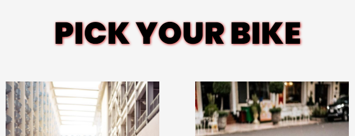
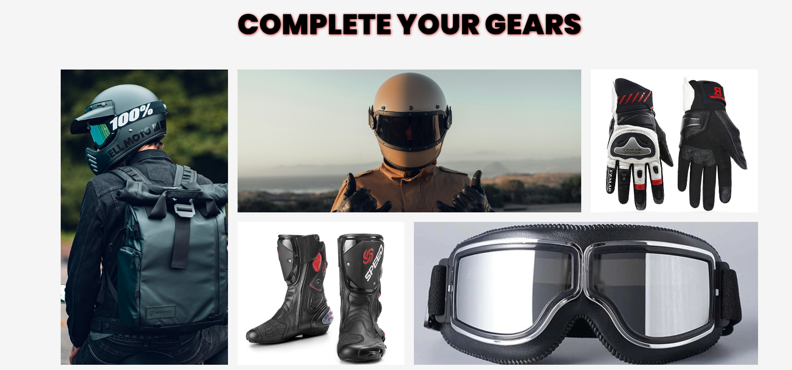
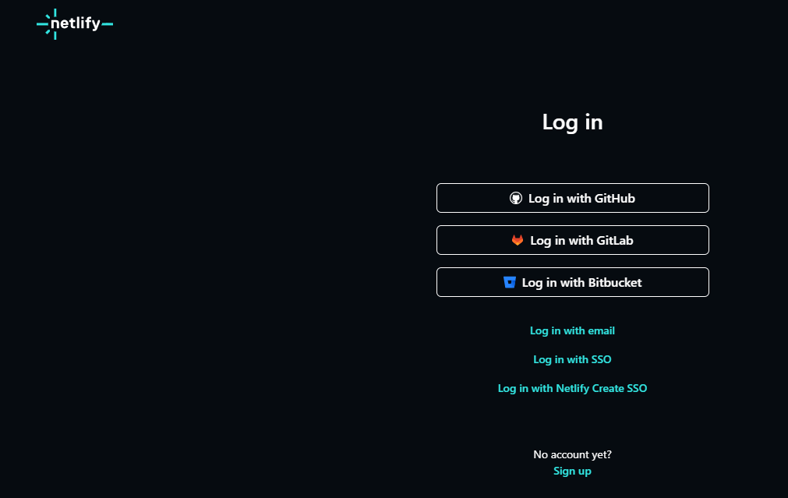
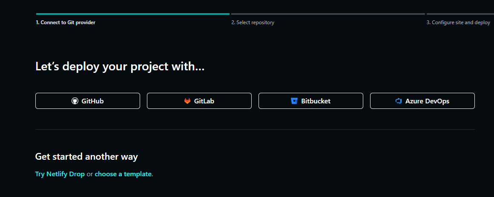

# ABOUT THIS PROJECT

#### TASK

##### 1. Custom Font Using GOOGLE FONT,  Responsive background image and simple animation

##### 2. Text Shadow To Text

##### 3.  Asymmetrical layout using grid  and  Responsive images

## HOW TO LOGIN TO NETLIFY :

##### 1. Login in using github account

##### 2. Add new site and import an existing project

##### 3. Deploy your Project with github account

##### 4. pick the project 

## TAKE A PEEP AT MY PROJECT

### https://revou-fsse-oct24.github.io/module-2-conkehlicious/
### https://vegasrent.netlify.app/
### https://thongdarren.my.id/

