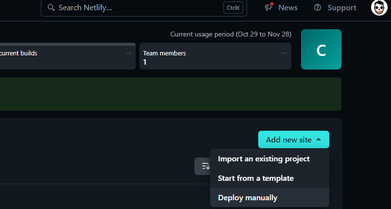
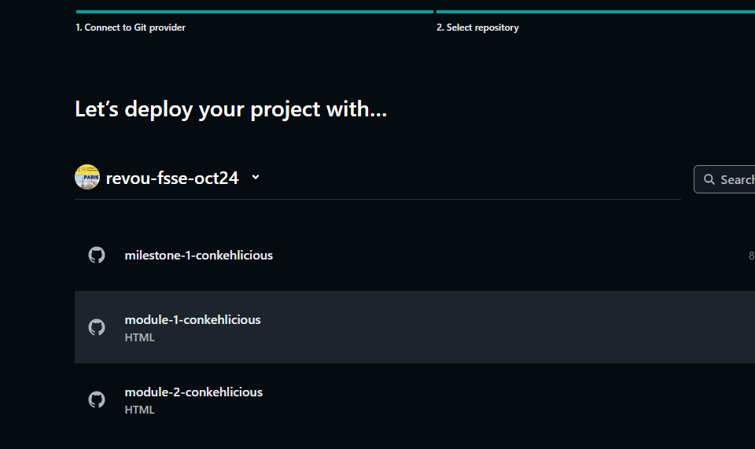

# ABOUT THIS PROJECT

#### TASK

##### 1. Custom Font Using GOOGLE FONT,  Responsive background image and simple animation

##### 2. Text Shadow To Text

##### 3.  Asymmetrical layout using grid  and  Responsive images

## HOW TO LOGIN TO NETLIFY :

##### 1. Login in using github account

##### 2. Add new site and import an existing project

##### 3. Deploy your Project with github account

##### 4. pick the project 

##### 5. custom your site name and wait for the process...and you are done

## HOW TO ADD DOMAIN TO NETLIFY

##### To connect a custom domain and DNS in Netlify, you can do the following:
###### • Log in to your Netlify account 
###### • Select the site you want to link to a custom domain 
###### • Click Set up a custom domain 
###### • Enter the domain you want to add and click Verify 
###### • Confirm that you own the domain and click Add domain 
###### • Click the options menu next to your new domain and choose Set up Netlify DNS 
###### • Copy the name servers from the domain name servers screen 
###### •In the dashboard where you bought your domain, set the DNS to custom DNS and add the DNS names from Netlify 
###### • You might need to wait a few minutes for the settings to propagate. 

## TAKE A PEEP AT MY PROJECT

### https://revou-fsse-oct24.github.io/module-2-conkehlicious/
### https://vegasrent.netlify.app/
### https://thongdarren.my.id/

